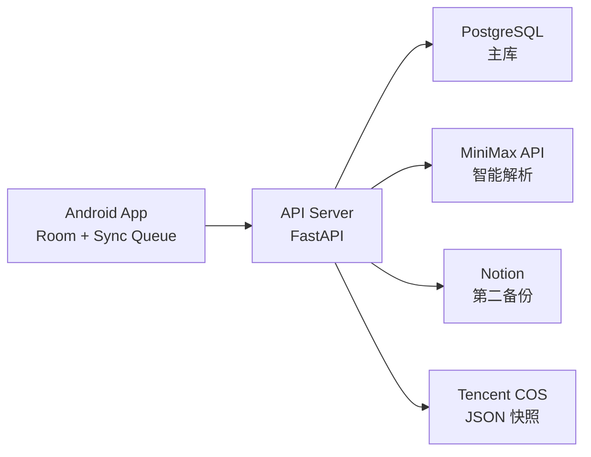

# 鸿运账本联网版技术方案

## 1. 目标

把当前 `本地版鸿运账本` 升级成 `本地优先 + 云端同步` 的家庭账本应用，满足以下场景：

- 家庭内部 `<= 5` 人使用
- 多台手机可访问同一本账
- 记账仍然要快，断网时也能用
- 服务器保存主数据
- Notion 保留一份可读备份
- 每天生成一份可恢复的 `JSON` 快照
- 一句话记账后续可接入 `MiniMax` 做智能解析

## 2. 总体原则

### 2.1 产品原则

- `本地优先`：手机先写本地数据库，再异步同步到服务器
- `服务器主库`：多人共享和多设备同步以服务器为准
- `Notion 只做第二备份`：可查、可看、可人工核对，但不做唯一恢复源
- `JSON/COS 做灾备`：真正的恢复依赖结构化快照，不依赖文档系统
- `智能解析只给建议`：大模型只返回候选账单，用户确认后才入账

### 2.2 工程原则

- 优先复用当前安卓端 `Room + ViewModel + Compose` 结构
- 联网升级尽量不推翻现有本地能力
- 后端以简单、稳定、可维护为先，不追求大而全
- 所有外部能力都放到服务器侧：`MiniMax`、`Notion`、`COS`

## 3. 推荐技术栈

## 3.1 安卓端

- `Kotlin`
- `Jetpack Compose`
- `Room`
- `ViewModel`
- `WorkManager`
- `Retrofit + OkHttp + Kotlinx Serialization`
- `DataStore` 存登录态和轻量配置

选择原因：

- 当前项目已经是这套栈，改造成本最低
- Room 很适合做本地缓存和离线队列
- WorkManager 适合后台同步、重试、定时补偿

## 3.2 服务端

- `FastAPI`
- `PostgreSQL`
- `SQLAlchemy`
- `Alembic`
- `Nginx`
- `Docker Compose`

可选但不是首发必需：

- `Redis`
- `Celery / RQ`

选择原因：

- Python 接 `MiniMax`、`Notion`、`COS` 都顺手
- FastAPI 写结构化 API 很快
- 2C2G 机器跑这套压力可控

## 3.3 云服务

- `腾讯云 CVM`：部署 API 和 PostgreSQL
- `腾讯云 COS`：存每日 JSON 快照，后续也可存附件
- `Notion`：第二备份和可读副本
- `MiniMax API`：一句话记账的智能解析

## 4. 总体架构



## 5. 联网版产品形态

## 5.1 用户视角

用户打开 App 后：

- 登录自己的家庭账号
- 看到自己可访问的账本
- 记账时先写本地
- 有网时自动同步
- 同一家庭成员可以在不同手机看到同一本账
- 一句话记账可选：
  - 本地解析
  - 智能解析

## 5.2 数据流原则

### 写入

1. 用户在手机上新增/编辑/删除交易
2. 先写 Room
3. 写一条本地待同步操作
4. WorkManager 后台推送到服务器
5. 服务器入主库
6. 异步写 Notion
7. 定时写 JSON 快照到 COS

### 读取

1. App 启动后拉取云端变更
2. 合并到本地 Room
3. UI 永远从 Room 读

这样做的好处：

- 打开快
- 弱网也能用
- 同步逻辑和 UI 解耦

## 6. 数据模型设计

## 6.1 服务器核心表

### `users`

- `id` UUID
- `phone` 或 `username`
- `display_name`
- `password_hash`
- `role`
- `created_at`
- `updated_at`

### `devices`

- `id` UUID
- `user_id`
- `device_name`
- `platform`
- `last_seen_at`
- `created_at`

### `books`

- `id` UUID
- `name`
- `owner_user_id`
- `created_at`
- `updated_at`
- `deleted_at`

### `book_memberships`

- `id` UUID
- `book_id`
- `user_id`
- `role` (`owner` / `editor` / `viewer`)
- `created_at`

### `members`

- `id` UUID
- `book_id`
- `name`
- `active`
- `created_at`
- `updated_at`
- `deleted_at`

### `accounts`

- `id` UUID
- `book_id`
- `name`
- `initial_balance`
- `active`
- `created_at`
- `updated_at`
- `deleted_at`

### `categories`

- `id` UUID
- `book_id`
- `type`
- `name`
- `sort_order`
- `active`
- `created_at`
- `updated_at`
- `deleted_at`

### `journal_entries`

- `id` UUID
- `book_id`
- `entry_date`
- `raw_text`
- `source_type` (`manual` / `nlp_local` / `nlp_cloud`)
- `created_at`
- `updated_at`
- `deleted_at`

### `transactions`

- `id` UUID
- `book_id`
- `member_id`
- `account_id`
- `category_id`
- `journal_entry_id` 可空
- `type`
- `amount`
- `occurred_at`
- `note`
- `source_type` (`manual` / `nlp_local` / `nlp_cloud`)
- `created_by_user_id`
- `created_at`
- `updated_at`
- `deleted_at`
- `version`

### `operation_logs`

- `id` UUID
- `book_id`
- `entity_type`
- `entity_id`
- `operation_type`
- `payload_json`
- `client_mutation_id`
- `operator_user_id`
- `created_at`

### `sync_cursors`

- `id` UUID
- `book_id`
- `cursor_value`
- `created_at`

### `notion_sync_records`

- `id` UUID
- `entity_type`
- `entity_id`
- `notion_page_id`
- `sync_status`
- `last_synced_at`
- `last_error`

### `backup_snapshots`

- `id` UUID
- `book_id`
- `snapshot_date`
- `storage_key`
- `checksum`
- `created_at`

## 6.2 安卓本地表需要补的字段

当前本地实体建议逐步增加：

- `remoteId: String?`
- `syncState: String` (`LOCAL_ONLY` / `DIRTY` / `SYNCED` / `DELETED`)
- `deletedAt: Instant?`
- `serverUpdatedAt: Instant?`
- `version: Long`

此外增加一张本地同步队列表：

### `pending_sync_operations`

- `id`
- `entity_type`
- `entity_local_id`
- `operation_type`
- `payload_json`
- `client_mutation_id`
- `status`
- `retry_count`
- `created_at`

## 7. 同步方案

## 7.1 同步策略

采用 `本地优先 + 增量同步`：

- UI 所有读写都先走本地
- 同步任务异步执行
- 服务端保存操作日志或变更游标
- 客户端用 `cursor` 拉增量

## 7.2 推送流程

1. 本地新增/修改/删除记录
2. 标记记录为 `DIRTY`
3. 写入 `pending_sync_operations`
4. WorkManager 触发上传
5. 调用 `POST /v1/sync/push`
6. 成功后更新本地记录：
   - `remoteId`
   - `syncState = SYNCED`
   - `version`

## 7.3 拉取流程

1. 客户端保存每个账本的 `cursor`
2. 调用 `GET /v1/sync/pull?bookId=...&cursor=...`
3. 服务端返回增量变更
4. 本地按 `remoteId` 合并
5. 更新本地 `cursor`

## 7.4 冲突处理

首版采用简单可控策略：

- 标量字段冲突：`updated_at` 新者覆盖旧者
- 删除优先于编辑：`deleted_at` 存在时视为删除
- 同一交易多人同时编辑时：服务器以最后写入为准

对你这个家庭场景，这套足够。

不建议一开始上复杂 CRDT。

## 8. API 设计

## 8.1 认证

### `POST /v1/auth/login`

输入：

- `username`
- `password`
- `deviceName`

输出：

- `accessToken`
- `refreshToken`
- `user`

### `POST /v1/auth/refresh`

### `POST /v1/auth/logout`

## 8.2 启动引导

### `GET /v1/bootstrap`

返回：

- 当前用户
- 用户可访问账本
- 每个账本的基础资料
- 首次同步游标

## 8.3 同步

### `POST /v1/sync/push`

请求：

```json
{
  "bookId": "uuid",
  "operations": [
    {
      "clientMutationId": "uuid",
      "entityType": "transaction",
      "operationType": "upsert",
      "payload": {}
    }
  ]
}
```

### `GET /v1/sync/pull`

参数：

- `bookId`
- `cursor`

响应：

```json
{
  "nextCursor": "12345",
  "changes": []
}
```

## 8.4 备份

### `POST /v1/backups/export`

生成指定账本的 JSON 快照并上传 COS。

### `GET /v1/backups`

列出可恢复快照。

### `POST /v1/backups/restore`

从快照恢复到新账本或覆盖恢复。

## 8.5 智能解析

### `POST /v1/ai/parse-natural-language`

请求示例：

```json
{
  "bookId": "uuid",
  "text": "今天和妈妈吃火锅花了300元，昨天爸爸买菜花了86元",
  "today": "2026-03-16",
  "members": ["我", "妈妈", "爸爸"],
  "expenseCategories": ["餐饮", "购物", "交通", "居家"],
  "incomeCategories": ["工资", "奖金", "报销"],
  "accounts": ["微信", "支付宝", "现金"]
}
```

响应示例：

```json
{
  "diaryText": "今天和妈妈吃火锅花了300元，昨天爸爸买菜花了86元",
  "transactions": [
    {
      "type": "expense",
      "amount": 300,
      "date": "2026-03-16",
      "member": "我",
      "category": "餐饮",
      "account": null,
      "note": "和妈妈吃火锅",
      "confidence": 0.92
    }
  ],
  "warnings": []
}
```

规则：

- 服务器只返回候选结果
- 安卓端展示并允许编辑
- 用户确认后再写交易表

## 9. Notion 备份方案

## 9.1 Notion 的角色

Notion 用途只包括：

- 第二备份
- 人工查看
- 家庭内部共享查看
- 核对同步状态

Notion 不承担：

- 主库
- 实时查询接口
- 真正的灾难恢复主来源

## 9.2 Notion 建议结构

建议建 3 个数据库：

### `Transactions`

- 交易时间
- 账本名
- 成员名
- 账户名
- 分类名
- 收支类型
- 金额
- 备注
- 来源
- 服务器交易 ID
- 同步时间

### `Journals`

- 日期
- 账本名
- 原始文本
- 来源
- 服务器日记 ID
- 同步时间

### `SyncLogs`

- 批次号
- 同步时间
- 成功条数
- 失败条数
- 错误摘要

## 9.3 同步方式

- 记账成功后不直接同步 Notion
- 由后台异步任务批量写入
- 写入失败不影响主业务成功
- 记录 `notion_page_id`
- 支持重试

## 10. JSON 快照与 COS 灾备

## 10.1 快照内容

每个账本导出：

- 账本
- 成员
- 账户
- 分类
- 日记
- 交易
- 导出时间
- schema 版本

## 10.2 快照策略

- 每天凌晨全量快照一次
- 每次手动点“备份”也生成一次
- 文件上传到 `COS`
- 文件命名：
  - `books/{bookId}/snapshots/2026-03-16T03-00-00Z.json`

## 10.3 恢复策略

支持两种恢复：

- 恢复为新账本
- 覆盖现有账本

首版建议只开放：

- `恢复为新账本`

这样更安全。

## 11. MiniMax 智能解析方案

## 11.1 调用原则

- 安卓端不直接持有 API Key
- 只由服务器调用 MiniMax
- 所有 prompt 和 schema 控制都在服务器

## 11.2 解析流程

1. App 提交原始文本和上下文
2. 服务器构造 prompt
3. MiniMax 返回结构化 JSON
4. 服务器做二次校验
5. 返回安卓端候选结果
6. 用户确认后入账

## 11.3 服务端校验

至少校验：

- 金额必须是数字
- 日期必须合法
- 类型必须是 `income` 或 `expense`
- 成员和分类必须在当前账本可用集合中
- 缺失字段允许为空，但不能伪造

## 11.4 失败兜底

如果云端解析失败：

- 回退到本地规则解析
- 或提示用户稍后重试

## 12. 安卓端改造清单

## 12.1 新增模块

- `auth`
- `network/api`
- `sync`
- `datastore`

## 12.2 重点类

建议新增：

- `AuthRepository`
- `RemoteLedgerService`
- `SyncRepository`
- `SyncWorker`
- `TokenManager`
- `ConflictResolver`

## 12.3 一句话记账升级

当前已有本地解析器：

- 保留 `本地快速解析`
- 新增 `智能解析`
- UI 上只表现为一个入口，内部自动选择：
  - 有网时可请求云端增强解析
  - 没网时走本地解析

## 13. 服务端模块划分

## 13.1 API 模块

- `auth`
- `books`
- `sync`
- `backups`
- `ai`
- `health`

## 13.2 域服务模块

- `book_service`
- `transaction_service`
- `sync_service`
- `backup_service`
- `notion_service`
- `minimax_service`

## 13.3 后台任务

- `notion_sync_worker`
- `daily_snapshot_job`
- `cleanup_job`

## 14. 部署方案

## 14.1 腾讯云 2C2G 部署建议

这台机器足够支撑家庭内部使用。

首发建议只跑这些服务：

- `nginx`
- `api`
- `postgres`

后台任务可以先直接跑在 API 进程内，避免首发就拆 worker。

## 14.2 Docker Compose 结构

- `nginx`
- `api`
- `postgres`

后续再按需要补：

- `worker`
- `redis`

## 14.3 资源控制

- Postgres 限制连接数
- Uvicorn/Gunicorn 只开少量 worker
- 日志按天滚动
- 定期清理无用临时文件

## 14.4 域名与 HTTPS

生产环境必须：

- 配域名
- 做备案
- 开 HTTPS

## 15. 安全方案

- `JWT access token + refresh token`
- 密码哈希存储
- 服务器校验每次账本访问权限
- MiniMax key、Notion token、COS key 全部只放服务端
- 重要操作写审计日志

家庭内部版首发不需要过度复杂，但这些底线要有。

## 16. 监控与运维

首发简化版即可：

- `/health` 健康检查
- API 日志
- 关键错误日志
- 每日备份任务日志
- Notion 同步失败日志

如果后续要稳定一些，再接：

- Sentry
- Uptime Kuma

## 17. 实施阶段

## 阶段 A：后端底座

- 搭 FastAPI 工程
- 接 PostgreSQL
- 做认证和账本基础表
- 部署到腾讯云

交付结果：

- 用户能登录
- 服务器能保存账本和交易

## 阶段 B：安卓联网与同步

- 安卓端加登录
- Room 表加同步字段
- 增加 push/pull 同步
- 多设备可看到同一本账

交付结果：

- 联网可用
- 断网也能记
- 恢复网络后自动同步

## 阶段 C：备份体系

- 服务器导出 JSON 快照
- 上传 COS
- 接 Notion 异步备份

交付结果：

- 有主库
- 有 Notion 第二备份
- 有 COS 灾备快照

## 阶段 D：智能解析

- 服务端接 MiniMax
- 安卓端加云端解析开关
- 保留本地解析兜底

交付结果：

- 一句话记账解析质量明显提升

## 18. 最终建议

对这个项目，最稳的落地路线是：

1. 保留当前本地 App 架构
2. 用 `FastAPI + PostgreSQL` 补一个轻量后端
3. 用 `本地优先 + 增量同步` 做联网版
4. 用 `Notion` 做第二备份
5. 用 `COS JSON 快照` 做真正可恢复备份
6. 用 `MiniMax` 做服务端智能解析增强

这套方案和你现在的代码、服务器规格、家庭使用场景是匹配的，不需要推翻重来。
