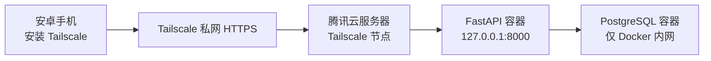

# 腾讯云部署与安全方案

这份文档针对当前 `鸿运账本` 的家庭使用场景：

- 用户量 `<= 5`
- 你有一台腾讯云 `2C2G / 50G` 服务器
- 优先保证安全
- 暂时没有自己的域名

结论先说：

- `不要` 直接把 PostgreSQL 暴露到公网
- `不要` 长期把 API 的 `8000` 端口裸露在公网
- `推荐` 用 `Tailscale 私网 + HTTPS`，这样没有域名也能安全联网

## 1. 推荐架构



这样做的好处：

- 不需要购买域名
- 不需要把 API 暴露给整个互联网
- 家庭成员手机装上 Tailscale 后就能访问
- PostgreSQL 永远不对公网开放

## 2. 生产环境要点

当前仓库已经提供：

- 生产部署文件：[docker-compose.prod.yml](../docker-compose.prod.yml)
- 生产环境变量示例：[backend/.env.production.example](../backend/.env.production.example)
- 部署脚本目录：[deploy/tencent-cloud](../deploy/tencent-cloud)

其中最关键的安全差异是：

- 数据库没有公网端口
- API 只绑定到服务器本机 `127.0.0.1:8000`
- 对外访问交给 Tailscale

## 3. 服务器部署步骤

以下命令以 Ubuntu 为例。

如果你打算直接交给 OpenClaw 执行，可以直接使用：

- [OPENCLAW_DEPLOY_PROMPT.md](../deploy/tencent-cloud/OPENCLAW_DEPLOY_PROMPT.md)

### 3.1 安装基础软件

```bash
sudo bash deploy/tencent-cloud/bootstrap_ubuntu.sh
```

### 3.2 拉取代码

```bash
cd /opt
sudo git clone https://github.com/hbw1/jizhangone.git
cd /opt/jizhangone
```

### 3.3 准备生产环境变量

```bash
bash deploy/tencent-cloud/prepare_prod_env.sh /opt/jizhangone
```

脚本会自动生成：

- 数据库密码
- `SECRET_KEY`
- 默认的 `CORS_ORIGINS`

如果你已经知道服务器的 Tailscale MagicDNS，可以先带环境变量执行：

```bash
TAILSCALE_HOSTNAME=your-server-name.your-tailnet.ts.net bash deploy/tencent-cloud/prepare_prod_env.sh /opt/jizhangone
```

## 4. 安装 Tailscale

### 4.1 服务器安装

```bash
sudo bash deploy/tencent-cloud/install_tailscale.sh
```

执行后，终端会给你一个登录链接。登录后，这台腾讯云机器就会加入你的 Tailscale 网络。

如果你已经有 `TS_AUTHKEY`，可以这样无交互部署：

```bash
sudo TS_AUTHKEY=tskey-xxxxx bash deploy/tencent-cloud/install_tailscale.sh
```

### 4.2 手机安装

让家里要使用 App 的手机都安装 Tailscale，并登录同一个 tailnet。

这样后面这些手机就能安全访问你的服务器，而不需要开放整个公网接口。

## 5. 启动后端

```bash
cd /opt/jizhangone
bash deploy/tencent-cloud/deploy_backend.sh /opt/jizhangone
```

检查容器状态：

```bash
sudo docker compose -f docker-compose.prod.yml ps
```

这时 API 只监听服务器本机：

- `127.0.0.1:8000`

PostgreSQL 不会暴露给公网。

## 6. 通过 Tailscale 暴露 HTTPS

在服务器上执行：

```bash
sudo bash deploy/tencent-cloud/publish_tailscale_https.sh
```

这一步的作用是：

- 给你的 API 加上 HTTPS
- 只在 Tailscale 私网内可访问
- 不需要你自己买域名

然后打开：

```bash
tailscale status
```

或者去 Tailscale 管理后台查看这台机器的 MagicDNS 名称，通常会像：

```text
your-server-name.your-tailnet.ts.net
```

最终 App 里填的地址就是：

```text
https://your-server-name.your-tailnet.ts.net/
```

你也可以先在任意已登录 Tailscale 的设备上验证：

- `https://your-server-name.your-tailnet.ts.net/docs`
- `https://your-server-name.your-tailnet.ts.net/health`

也可以用仓库脚本做本机检查：

```bash
cd /opt/jizhangone
bash deploy/tencent-cloud/verify_backend.sh
```

## 7. 腾讯云安全组怎么配

推荐只开放这些端口：

- `22`：SSH
- `443`：如果你后面需要公网反代时再开
- `80`：如果你后面要接域名和 HTTPS 证书时再开

当前这个 `Tailscale 私网方案` 下，可以更保守：

- `22` 开放给你自己的管理 IP
- `80/443/8000/5432` 都不对公网开放

重点：

- `5432` 不要开
- `8000` 不要开

## 8. App 里怎么连接

手机装好 Tailscale 并登录后，在 App 里：

1. `设置`
2. `云端同步`
3. `连接云端`
4. 服务器地址填写：

```text
https://your-server-name.your-tailnet.ts.net/
```

5. 保存服务器地址
6. 注册或登录
7. 点 `立即同步`

## 9. 如果暂时不想装 Tailscale

也可以临时走公网 IP 测试，但只建议短期验证：

1. 在安全组里临时开放 `TCP 8000`
2. 把 `docker-compose.prod.yml` 里的 API 端口从：

```yaml
127.0.0.1:8000:8000
```

改成：

```yaml
8000:8000
```

3. App 里填：

```text
http://43.156.49.98:8000/
```

这条路的问题是：

- 没有 HTTPS
- 接口直接暴露到公网
- 登录接口会长期暴露

所以它只适合临时测试，不适合长期家庭使用。

## 10. 当前最推荐的结论

如果你现在没有域名，又想优先保证安全，最合适的路线是：

1. 腾讯云服务器部署 `docker-compose.prod.yml`
2. 安装 Tailscale
3. 用 `tailscale serve` 提供私网 HTTPS
4. 家庭成员手机安装 Tailscale
5. App 连接 `https://你的 MagicDNS 地址/`

这样比“公网 IP + 8000”安全得多，也比现在就买域名、折腾证书更省事。
